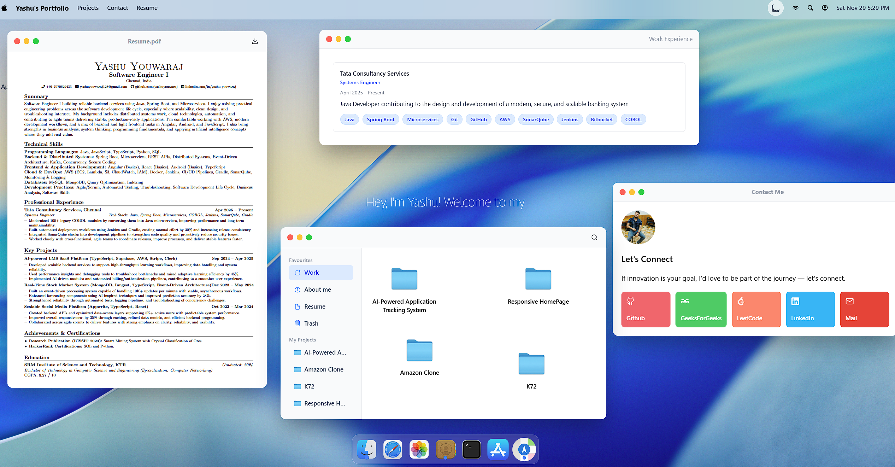
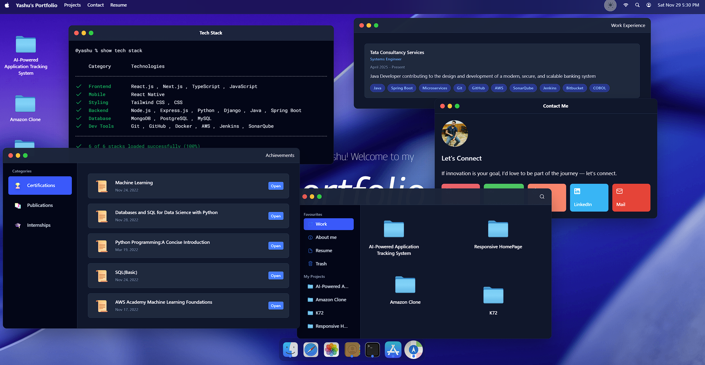
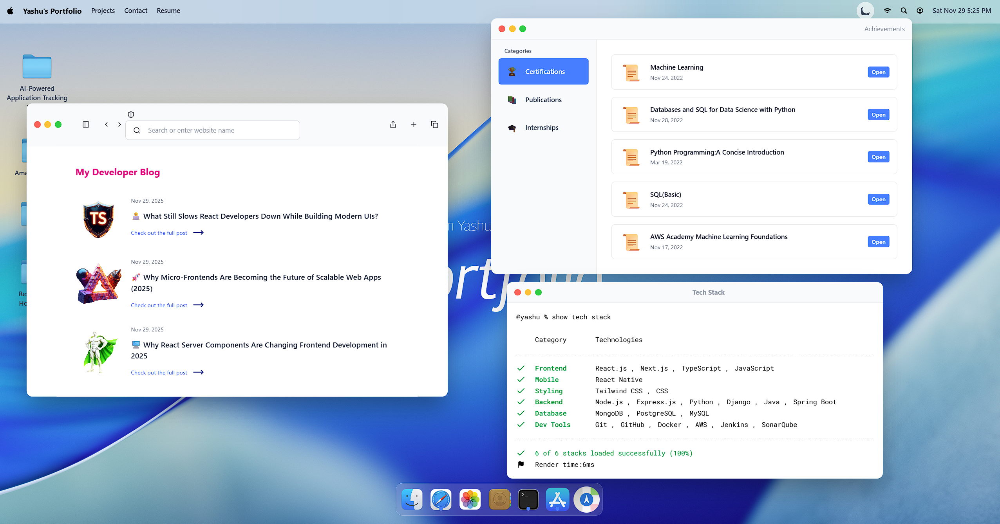

# 🌟 Yashu's Portfolio

A modern, interactive **macOS–inspired portfolio** built with **React, Tailwind CSS, GSAP, and Zustand**.  
Features fully functional draggable windows, beautiful animations, dark/light themes, and a desktop-like UI experience.

### 🔗 Live Demo  
https://yashuyouwaraj.vercel.app  
(or your deployment link)

---

## 🚀 Overview

This portfolio replicates a **desktop operating system** experience with:
- Draggable windows  
- Minimize / Maximize / Close  
- Dock launcher  
- Navigation bar  
- Light/Dark theme  
- Smooth, high-quality animations  



Highly polished with GSAP motion effects, custom window management logic, and a responsive design.

---

## ✨ Features

- 🖥 **Desktop-like Interface** with draggable, stackable windows  
- 🌗 **Light & Dark Theme** with persistent storage  
- 🎞 **GSAP Animations** (windows, dock, navbar, loading screen)  
- ⚡ **Interactive Dock** with macOS-style hover scaling  
- 📁 **Finder-like File Browser**  
- 🖼 **Photos & Image Viewer**  
- 📄 **Resume & Achievement PDFs**  
- 👉 **Window Toggle System** (open/close on click)  
- 💬 **Contact Window**  
- 🛠 **Terminal-style Skills Window** 



---

## 🛠 Tech Stack

### **Frontend**
- React 19
- Vite

### **Styling & Animations**
- Tailwind CSS  
- GSAP (with Draggable)

### **State Management**
- Zustand + Immer

### **UI & Utilities**
- Lucide Icons  
- React Tooltip  
- React PDF  
- dayjs  
- clsx  



---

## 📁 Project Structure

```
src/
├── components/        # Navbar, Dock, Theme Toggle, etc.
├── windows/           # All draggable window components
├── store/             # Zustand stores
├── hoc/               # WindowWrapper (handles drag, minimize, maximize)
├── utils/             # GSAP animations
├── constants/         # Projects, skills, links, data
├── App.jsx
└── main.jsx
```

---

## 🎨 Theme System

- **Light Mode** — clean & minimal  
- **Dark Mode** — slate palette with blue accents  
- Backgrounds auto-switch using Zustand theme store.


---

## 🎬 Animations

Powered by **GSAP**:
- Window open/close/minimize/maximize  
- Drag interactions  
- Dock hover scaling  
- Navbar + Welcome + Dock entrance animations  
- Beautiful 4-second loading screen  

---

## ⚙️ Installation & Setup

```bash
# Clone repo
git clone https://github.com/yashuyouwaraj/MyPortfolio.git

cd MyPortfolio

# Install dependencies
npm install

# Start development
npm run dev

# Build production
npm run build

# Preview build
npm run preview
```

---

## 🔧 Configuration

Edit `src/constants/index.js` to update:
- Projects  
- Skills  
- Social links  
- Finder items  
- Dock items  

---

## 📦 Deployment

This project can be deployed to:
- **Vercel** (recommended)  
- Netlify  
- Cloudflare Pages  
- GitHub Pages  
- Render  

Just build using:

```bash
npm run build
```

and upload the `dist/` folder or connect the repo.

---

## 🤝 Credits

- macOS UI inspiration  
- GSAP for world-class animations  
- Tailwind CSS for styling  

---

## 📄 License

This is a personal portfolio.  
You can use ideas/designs for learning and inspiration.

Developed By Yashu Youwaraj
